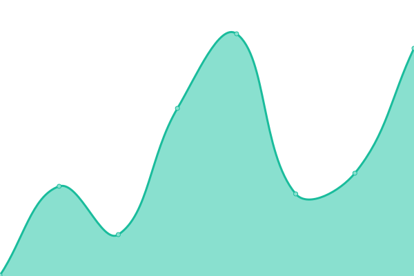
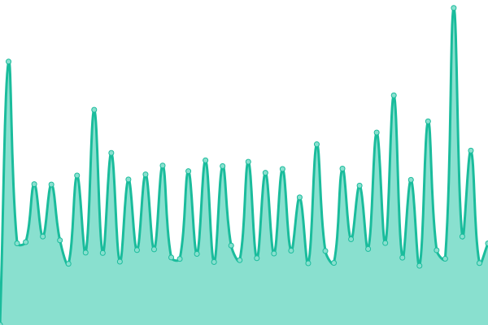
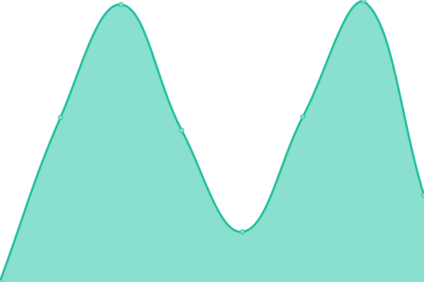

# [📈 Live Status](https://trybunce.github.io/bunce-uptime): <!--live status--> **🟨 Degraded performance**

This repository contains the open-source uptime monitor and status page for [Bunce](https://bunce.so), powered by [Upptime](https://github.com/upptime/upptime).

With [Upptime](https://upptime.js.org), you can get your own unlimited and free uptime monitor and status page, powered entirely by a GitHub repository. We use [Issues](https://github.com/trybunce/bunce-uptime/issues) as incident reports, [Actions](https://github.com/trybunce/bunce-uptime/actions) as uptime monitors, and [Pages](https://trybunce.github.io/bunce-uptime) for the status page.

<!--start: status pages-->
<!-- This summary is generated by Upptime (https://github.com/upptime/upptime) -->
<!-- Do not edit this manually, your changes will be overwritten -->
<!-- prettier-ignore -->
| URL | Status | History | Response Time | Uptime |
| --- | ------ | ------- | ------------- | ------ |
|  [Bunce Docs](https://developers.bunce.so) | 🟩 Up | [bunce-docs.yml](https://github.com/trybunce/bunce-uptime/commits/HEAD/history/bunce-docs.yml) | 

 322ms
     
 | 

<a href="https://trybunce.github.io/bunce-uptime/history/bunce-docs">100.00%</a>
    

|  [Bunce App](https://app.bunce.so) | 🟩 Up | [bunce-app.yml](https://github.com/trybunce/bunce-uptime/commits/HEAD/history/bunce-app.yml) | 

 172ms
     
 | 

<a href="https://trybunce.github.io/bunce-uptime/history/bunce-app">100.00%</a>
    

|  [Bunce Base](https://base.bunce.so) | 🟩 Up | [bunce-base.yml](https://github.com/trybunce/bunce-uptime/commits/HEAD/history/bunce-base.yml) | 

 435ms
     
 | 

<a href="https://trybunce.github.io/bunce-uptime/history/bunce-base">100.00%</a>
    

|  [Bunce Sandbox](https://sandbox.bunce.so) | 🟩 Up | [bunce-sandbox.yml](https://github.com/trybunce/bunce-uptime/commits/HEAD/history/bunce-sandbox.yml) | 

 553ms
     
 | 

<a href="https://trybunce.github.io/bunce-uptime/history/bunce-sandbox">90.82%</a>
    

|  [Bunce APIs](https://api.bunce.so) | 🟩 Up | [bunce-ap-is.yml](https://github.com/trybunce/bunce-uptime/commits/HEAD/history/bunce-ap-is.yml) | 

 494ms
     
 | 

<a href="https://trybunce.github.io/bunce-uptime/history/bunce-ap-is">100.00%</a>
    

|  [Bunce APIs (Sandbox)](https://sandbox.api.bunce.so) | 🟨 Degraded | [bunce-ap-is-sandbox.yml](https://github.com/trybunce/bunce-uptime/commits/HEAD/history/bunce-ap-is-sandbox.yml) | 

 5334ms
     
 | 

<a href="https://trybunce.github.io/bunce-uptime/history/bunce-ap-is-sandbox">0.00%</a>
    

|  [Bunce Blog](https://blog.bunce.so) | 🟩 Up | [bunce-blog.yml](https://github.com/trybunce/bunce-uptime/commits/HEAD/history/bunce-blog.yml) | 

 1234ms
     
 | 

<a href="https://trybunce.github.io/bunce-uptime/history/bunce-blog">100.00%</a>
    

<!--end: status pages-->

[**Visit our status website →**](https://trybunce.github.io/bunce-uptime)

## 📄 License

- Powered by: [Upptime](https://github.com/upptime/upptime)
- Code: [MIT](./LICENSE) © [Anand Chowdhary](https://anandchowdhary.com), supported by [Pabio](https://pabio.com)
- Data in the `./history` directory: [Open Database License](https://opendatacommons.org/licenses/odbl/1-0/)
